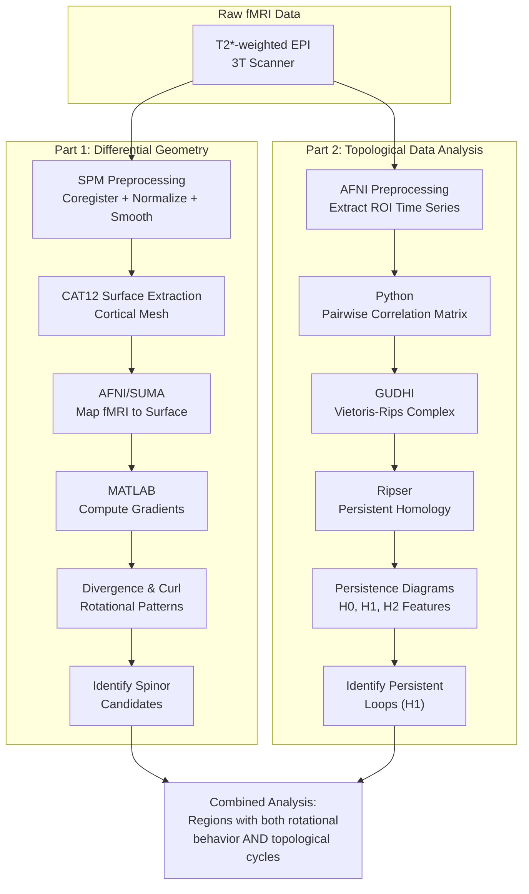
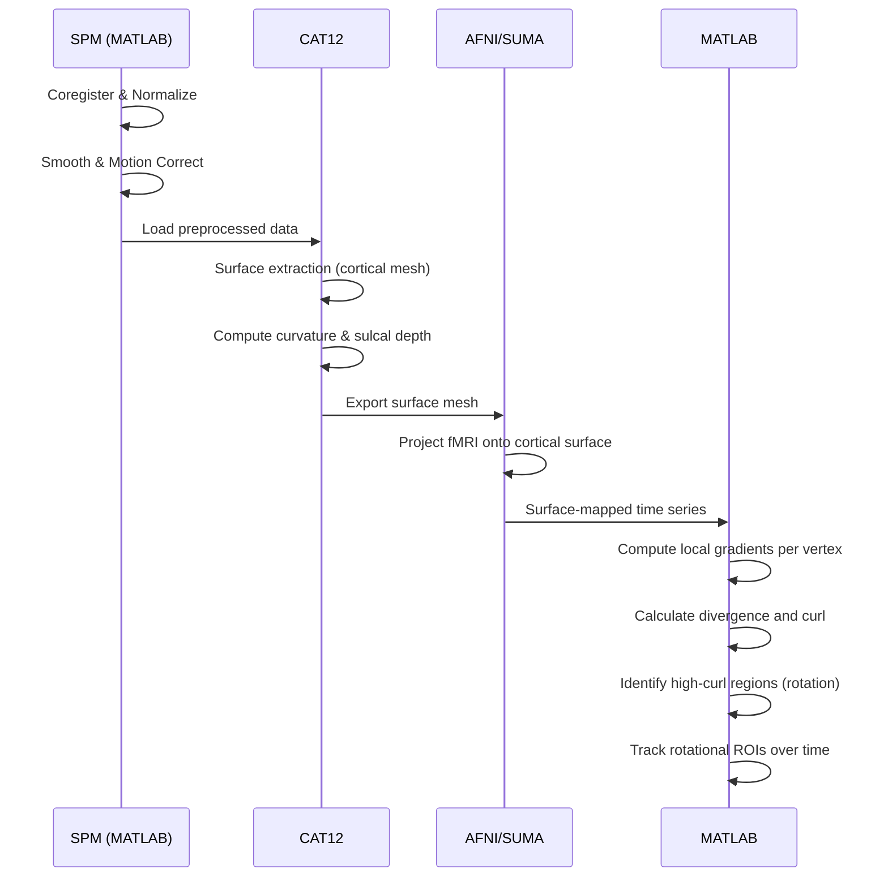
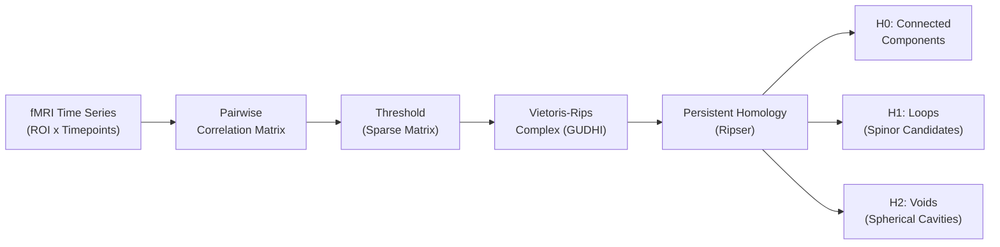

**FMRI Differential Geometry** is a computational neuroscience research project that combines differential geometry with topological data analysis (TDA) to detect spinor-like rotational structures in functional magnetic resonance imaging (fMRI) data. The project hypothesizes that certain patterns of brain activity exhibit continuous rotational symmetry — analogous to spinors in physics — and develops a two-pronged computational pipeline to identify them.

The first prong uses **differential geometry analysis** on the cortical surface: fMRI data is projected onto a cortical mesh (via SPM/CAT12), local activity gradients are computed at each vertex, and divergence/curl operators identify regions of persistent rotational flow. The second prong applies **persistent homology** (via Ripser/GUDHI) to detect topological loops (H1 features) and voids (H2 features) in the functional connectivity structure, which may correspond to cyclic neural activity patterns.

This project integrates multiple toolchains — MATLAB (SPM, CAT12), Python (GUDHI, Ripser, Scikit-TDA), and AFNI/SUMA — across several sub-projects.

---

## Pipeline Architecture

---

## Part 1: Differential Geometry Analysis

This analysis captures rotation-like structures or orientation properties in the brain's functional activity.

**Tools:**
- **MATLAB** — differential geometry calculations and visualizations
- **SPM** — fMRI preprocessing
- **CAT12** — surface-based analysis (computing curvature)
- **AFNI/SUMA** — surface data and functional data processing

**Step-by-Step Process:**

1. **Preprocess fMRI Data** (SPM): Coregister, normalize, smooth, motion correct
2. **Surface Extraction** (CAT12): Generate cortical mesh, compute surface metrics (curvature, sulcal depth)
3. **Map Functional Data to Surface**: Project fMRI onto cortical mesh vertices using AFNI/SUMA
4. **Compute Rotational Symmetry** (MATLAB): Define orientation vectors, calculate local gradients, compute divergence and curl
5. **Identify Rotational Symmetry**: Visualize curl across surface, track high-curl regions over time
6. **Export Results**: Save ROIs exhibiting rotational behavior as masks

---

## Part 2: Topological Data Analysis (TDA)

The goal is to capture loop-like or spherical structures using persistent homology.

**Step-by-Step Process:**

1. **Preprocess and Extract Data** (AFNI): Segment brain into ROIs, extract time-series as CSV
2. **Format Data for Persistent Homology** (Python): Compute pairwise correlation, threshold matrix
3. **Construct the Simplicial Complex**: Build Vietoris-Rips complex with GUDHI at chosen epsilon
4. **Compute Persistent Homology**: Use Ripser for persistence diagrams (H0, H1, H2)
5. **Identify Spinor-Like Structures**: Find persistent H1 loops with cyclic temporal behavior
6. **Visualize and Interpret**: Persistence diagrams and barcodes via Matplotlib

---

