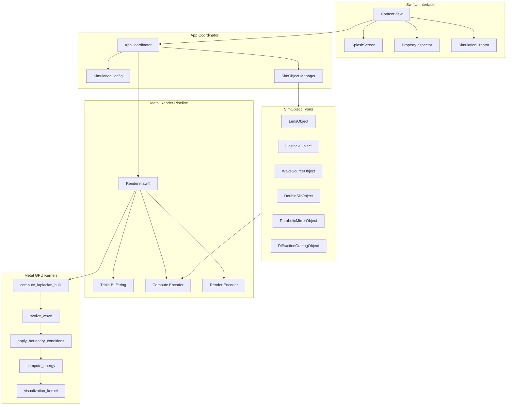
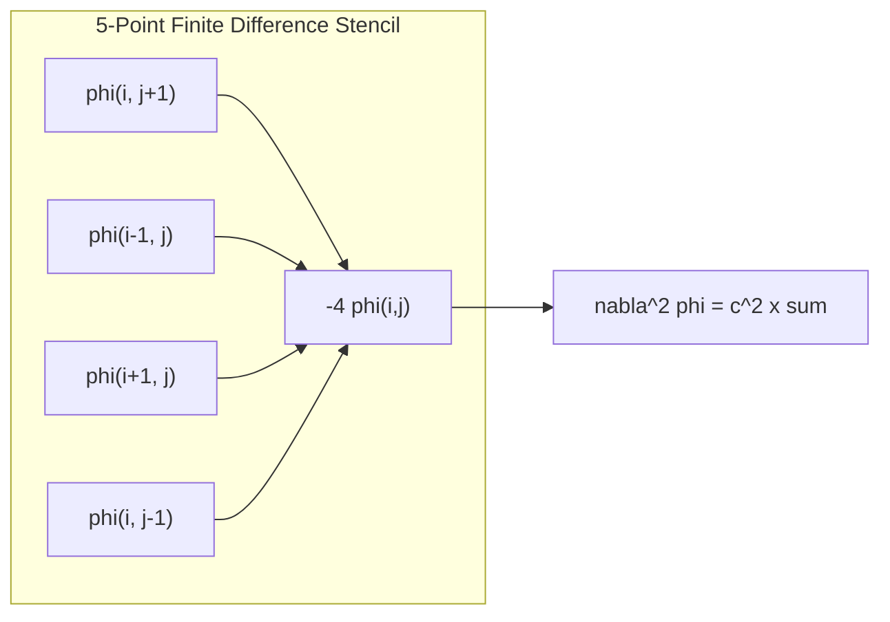
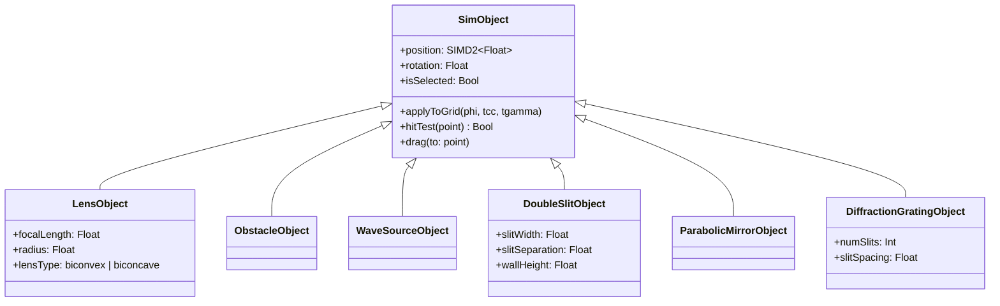
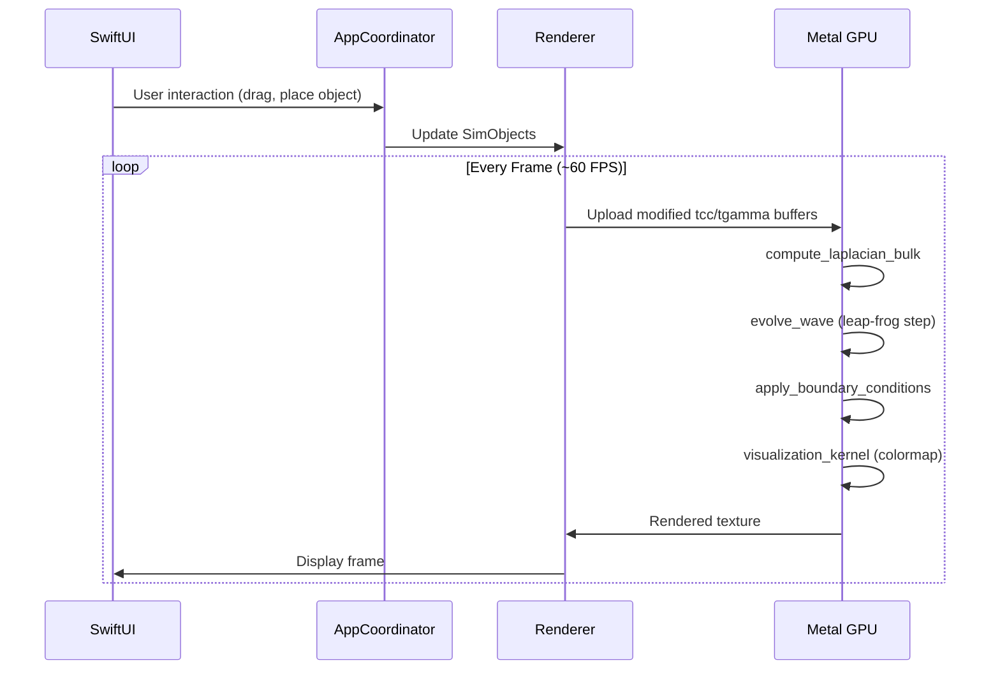

The **Wave Simulation App** is a native macOS application that provides an interactive, GPU-accelerated simulation of the two-dimensional wave equation. Built in Swift with Apple's Metal compute framework, it evolves from an original C/OpenGL codebase written by Nils Berglund into a modern, user-friendly desktop application. Users can place, drag, and configure optical and physical objects — lenses, obstacles, mirrors, diffraction gratings, double slits, and wave sources — directly onto a live wave field, observing interference, refraction, reflection, and diffraction in real time.

The project spans two repositories: **AGPhysicsSims** (the original C simulation engine with 100+ domain shapes and OpenMP parallelization) and **MetalShaders/WaveBilliardApp** (the Swift/Metal port with a full SwiftUI interface). The Metal port preserves the numerical core — a finite-difference Laplacian with leap-frog time integration — while offloading all grid computation to GPU compute kernels, achieving interactive frame rates at resolutions up to 4K (3840x2300).

The app includes a splash screen with preset simulations (Keplerian telescope, Flower of Life lens, double-slit interference), a custom simulation builder with domain shape selection, seven colormaps, energy-view mode, and a property inspector for editing object parameters live.

---

## Architecture



---

## Numerical Method

The simulation solves the 2D wave equation on a discrete grid:

$$\frac{\partial^2 \phi}{\partial t^2} = c^2 \nabla^2 \phi - \gamma \frac{\partial \phi}{\partial t}$$

where $\phi$ is the wave field amplitude, $c$ is the local wave speed (variable for refraction), and $\gamma$ is the damping coefficient.

### Metal Compute Kernels

The Laplacian is computed in parallel across the entire grid using a 5-point finite difference stencil:



The core GPU kernel computes the discrete Laplacian:

```c
kernel void compute_laplacian_bulk(
    device const float *phi [[buffer(0)]],
    device float *delta [[buffer(1)]],
    device const short *xy_in [[buffer(2)]],
    device const float *tcc [[buffer(3)]],
    device const float *tgamma [[buffer(4)]],
    constant int &nx [[buffer(5)]],
    constant int &ny [[buffer(6)]],
    uint2 gid [[thread_position_in_grid]])
{
    int i = gid.x + 1;
    int j = gid.y + 1;
    if (i >= nx-1 || j >= ny-1) return;
    int idx = i * ny + j;
    float val = tcc[idx] * (phi[(i+1)*ny+j] + phi[(i-1)*ny+j]
                           + phi[i*ny+j+1] + phi[i*ny+j-1]
                           - 4.0f * phi[idx]);
    val -= tgamma[idx] * phi[idx];
    delta[idx] = val;
}
```

Time integration uses leap-frog stepping:

```c
kernel void evolve_wave(
    device float *phi [[buffer(0)]],
    device float *psi [[buffer(1)]],
    device const float *delta [[buffer(2)]],
    constant float &dt [[buffer(4)]],
    uint2 gid [[thread_position_in_grid]])
{
    int idx = gid.x * ny + gid.y;
    float psi_new = psi[idx] + delta[idx] * dt;
    float phi_new = phi[idx] + psi_new * dt;
    psi[idx] = psi_new;
    phi[idx] = phi_new;
}
```

---

## SimObject System

Interactive objects are managed through a polymorphic `SimObject` protocol:



Each SimObject modifies the local wave speed coefficient (`tcc`) and damping (`tgamma`) buffers on the GPU, enabling real-time refraction through lenses and absorption by obstacles.

---

## Rendering Pipeline



---

## Domain Library

The simulation supports 100+ pre-defined domain shapes:

| Category | Examples |
|----------|----------|
| Classical | Rectangle, Ellipse, Stadium, Sinai billiard |
| Fractal | Julia set interior, Menger-Sierpinski carpet |
| Optical | Keplerian telescope, Flower of Life lens |
| Musical | Guitar body, Drum membrane |
| Lattice | Circle lattice, Hexagonal grid, Poisson disc |

---
